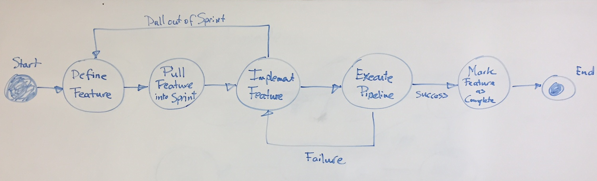
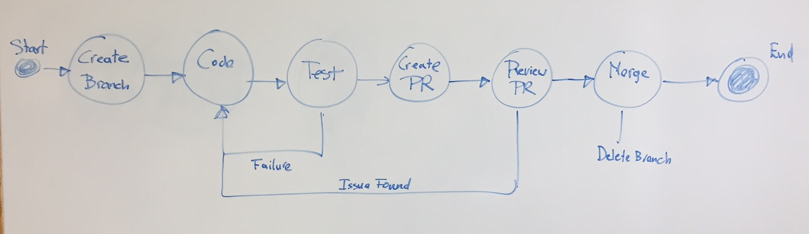

# Infrastructure-as-Code Approach

+ [Introduction](#intro)
+ [Workflow](#workflow)
   - [Feature Development Workflow](#dev-workflow)
   - [Feature Implementation Workflow](#impl-workflow)
+ [Development Practices](#practices)
+ [Tools](#tools)

## Introduction

TBD

## Workflow

### Feature Development Workflow

Overall development workflow is the "same" as any other development workflow
and assumes that uses short-lived feature branches. Note that a feature is
used here to indicate a relatively small individual change, not an aggregate
of multiple changes). This workflow is then applies to manage
infrastructure-as-code (IaC).

|Step|Process Phase              |Description                                 |
|----|---------------------------|--------------------------------------------|
| 1  | Define Feature            |Provide a high-level specification of the change, e.g. in a GitHub issue to plan for implementing a change. "Change security groups and/or Network ACLs to allow communication with Active Directory server" is an example of such a change.|
| 2  | Pull Feature into Sprint  |In Scrum the feature is planned for the current sprint, meaning it is added to the sprint during sprint planning. Then a developer starts working on it during the sprint. In Kanban a developer just starts working on it.|
| 3  | Implement feature	       |A developer actively works in implementing the feature. Once complete it triggers the Jenkins pipeline execution. Note that depending on you set this up, the development work can be part of the Jenkins pipeline execution. See Implementation Workflow.|
| 4  | Execute Pipeline          |The Jenkins pipeline executes Build product (if necessary), deploying product/executing deployment script, (manually/automatically)  test deployed product, propagate through downstream environments. After/before each step there could be manual check-points where a person must approve the pipeline from  continuing. After/before each step there could be notification sent to designated parties.|
| 5  | Mark the feature as complete|Mark the feature is completed, e.g. close the GitHub issue, once it is moved to the production environment.|

### Feature Implementation Workflow

|Step|Process Phase              |Description                                 |
|----|---------------------------|--------------------------------------------|
| 1  | Create Branch             |A developer starts with creating a new git branch in the applicable repository (or repositories). When using a Jenkins multi-branch pipeline (desirable) this would automatically detect the new branch and execute the branch. Or alternatively, the developer would have to enable Jenkins building the branch pipeline. If the pipeline is setup to deploy to downstream environments, need to ensure that feature branches only execute against an upstream environment.|
| 2	 | Code (and deploy)         |The developer clones the new repository, makes changes to the code, and deploys the code. E.g. changes are made in terraform scripts to update the NAT servers to use an AMI that has enhance networking, as well as to enable enhanced networking, to get better performance of internally generated outbound traffic. The developer runs the stack management script to update the terraform infrastructure stack, for the newly created branch. The Terraform stacks must create branch specific environments. This could be run locally, or be handled through Jenkins (which would then require git commits/pushes to the newly created branch).|
| 3	 | Test                      |The developer tests the deployed code. This could be manually, but ideally the developer creates automated tests that can be run repeatedly, as well as be built into the pipeline, using something like [serverspec](http://serverspec.org/) and/or [serverspec-aws-resources](https://github.com/stelligent/serverspec-aws-resources)|
| 4  |Create Pull Request (PR)   |Once the developer has completed testing, a PR is created, including a high-level description of the changes (for the reviewers).|
| 5  |Review Pull Request (PR)   |Reviewer(s) look at the PR ad determine if further changes are needed. If so assign back to the developer.|
| 6  |Merge branch               |Otherwise, merge (and delete the branch). This should kick-off the Jenkins pipeline for the branch which has been merged to.|

## Development Practices

+  __Make the code modular__
   1. Avoids the use of long variable names to provide context
   2. Divide scripts in multiple segments.
      This makes easier to track and merge changes
   3. Reuse of provisioning code
      This helpsto avoid copy-paste erros and difficult maintenance
+  __Ensure generated resources are identifiable__ 
   It is easy to generate a lot of resources (for multiple stacks and code 
   branches) that are not clearly labelled. This makes it harder to identify
   and manage those resources outside of Terraform/CoudFormation (if necessary).
   Especially viewing resources in the AWS consoles becomes easier when it is
   possible to select resources from a specific system/environment by using
   Tag filters.
   1. Use tags: System, Stack, Environment, Resource (ID); In AWS tagging enables
      the use Resource Groups that can make it easy to review and manage all
      resources from one central view. Note that when using AWS CloudFormation 
      a stack tag is provided automatically.
   2. Use naming scheme that combines some of the the above tags
      <System>_<Environment>_<Resource>
   3. The Terraform/CloudFormation stacks scripts must not hard-code the
      environment name at a minimum.
      Ideally the other values (except the resource id is shared/passed into
      the Terraform root module, or CloudFormation master script and passed
      down into Terraform modules/CloudFormation substacks.
+ __Enable/automate sharing of information across stacks__
   Avoids hard-coding of information which becomes cumbersome and
   error-prone when using multiple stacks, and multiple branches per
   stack.
+ __Allow for a multi-layer provisioning approach__
   1. (Bootstrap) Manually create S3 bucket(s) used by provisioning tools
   2. Use Terraform (and/or CloudFormation) to provision Infrastructure
      (VPC, subnets, routing, NACLs, ELBs, EIPs, etc.)
   3. Use Terraform (and/or CloudFormation) to provision resources
      (EC2 instances, ELBs, security groups, Elastic Cache, RDS instances,
       S3 buckets (not used for provisioing, etc.)
   4. Use Ansible (or Chef/Salt/Puppet) to provision OS and up on
      EC2 instances
   5. If using Docker, use Ansible (or Chef/Salt/Puppet) to provision and
      create Docker images

## Tools

1. [Jenkins](./jenkins/README.md)
2. [Terraform](./terraform/README.md)
3. [CloudFormation](./cloud-formation/README.md)
