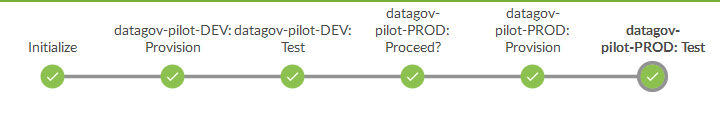

# Jenkins Pipelines

+ [Introduction](#intro)
+ [Jenkinsfile](#jenkinsfile)
+ [Using the Branching Strategy](#branching)
+ [Embedded Pipelines](#pipelines)
+ [Provisioners](#provisioners)

## <a name="intro"></a>Introduction

Jenkins is an open source automation server which organizations
can use to accelerate the software development process through automation.
Withe Jenkins Pipelines, you can:

- Model both simple and complex software delivery pipelines
- Support workflow process steps that require human interaction
- Recover from the point of failure, as opposed to starting over

Here we automated infrastructure-as-code with Jenkins multi-branch
pipelines. This allows for specifying your software delivery pipelines
as code and include it with your code in the GitHub repository,
rather than separately specifing that code in Jenkins jobs.
Multi-branch pipeline simplify parallel development using
[feature branches](../InfrastructureAsCode.md/#impl-workflow).
The pipeline is specified in the [`Jenkinsfile`](#jenkinsfile)
in the root of repository, which can be changes  right along
changes to the provision code.
The pipeline simply orchestrates executing of the provisioning,
as well as testing the provisioned infrastructure.

## <a name="jenkinsfile"></a>`Jenkinsfile`

The pipeline is specified to provision and test each environment,
starting in the dev environment, and propagating to downstream
environments, ultimately applying the provisioing changes to the
production environment.
Currently the pipeline only specifies `dev` and `prod`
(but more environments can be easily added).
The pipeline will stop to for user input to approve proceeding to
the next environment.



Here the Jenkinsfile is setup to handle multiple different embedded
pipelines

> NOTE: This was done for illustration purposes, but typically it is
> undesirable to share pipelines in a single repository, as this would
> hamper automation:
>
>    1. Automating running of the pipelines using either github commit
>       hooks or polling of github, would cause pipelines to run on
>       unrelated commits.
>    2. Automatic branch indexing would cause pipelines to run on
>       unrelated feature branches, thereby creating additonal,
>       unnecessary infrastructure.
>
> This also makes it diffcult for different pipelines to have different
> delivery process flows.


These pipelines follow a common execution pattern as described in pseudo-code:

```
    run-pipeline(pipeline):
      run-stages(pipeline, 'dev')
      run-stages(pipeline, 'prod')

    run-stages(pipeline, environment):
      if is-dev(environment) or
         (is-master(branch) and user-allows-proceed(environment))
      then
         pipeline.provision(environment)
         pipeline.test(environment)
      end

```

The `provision` and `test` stages are executed if the pipeline is
provisioning the development environment or
if the branch is the master branch and the user allows the pipeline
to proceed to the specific non-dev environment (prod).
Thus the exection of the pipeline for non-master branches, i.e. feature
development branches, does not proceed beyond the `dev` environment.
In order for those changes to be incorporated in downstream environments,
the changes must be merged into the master branch,

Each individual pipeline are to be defined in a separate Groovy scripts
that is loaded based on a pattern in the name of the Jenkins pipeline
job. These patterns are define in the Jenkinsfile in the
`getPipelineSelectors()` method.

Each pipeline then defines the actions to take during the `provision`
and `test` stages by defining the appropriate methods.
The pipeline scripts must follow this template:

```
def initialize(environment) {
  // perform any initialization steps
}

def provision(environment) {
   // perform any provisioning steps
}

def test(environment, outputDirectory) {
    def testsWereRun = false
    // perform anay tests, and if any are run set testsWereRun to true
    return testsWereRun
}

return this
```

See e.g. the [Data.gov Pilot Pipeline](./pipeline/datagov-pilot.groovy).
Note the `return this` statement at the end. This statement is required.

### <a name="branching"></a>Using the Branching Strategy

The [Branching Strategy](../InfrastructureAsCode.md/#impl-workflow)
defines the development process as:
1. Create an issue
2. Create feature branch for an issue
3. Implement and test the changes for the issue in that branch
4. Merge the feature branch into the master branch
5. The master branch propagates the change through the environments

The branching strategy is embedded in the automation process by using
feature branches as a separate set of AWS Resources within the `dev`
environment, labeling them as `dev-BRANCH-NAME`.

This allows each feature to be implemented and tested in isolation and
in parallel to other features, while utilizing Jenkins to execute the
pipeline.
As describe above, The Jenkinsfile prevents feature branch pipelines
from proceeding beyond the 'dev' environment.


## <a name="pipelines"></a>Embedded Pipelines

The `jenkinsfile` current supports the following pipelines:

1. [Shared Infrastructure Pipeline](./pipeline/shared-infrastructure.groovy)
2. [Data.gov Pilot Pipeline](./pipeline/datagov-pilot.groovy)
3. [D2D Example Pipeline](./pipeline/d2d.groovy)

Note that the Data.gov pipeline implements
[Postman](https://www.getpostman.com/docs/) tests to verify
the provisioing of a server by running Postman tests with
[Newman](https://www.npmjs.com/package/newman).


## <a name="provisioners"></a>Provisioner scripts

The pipeline make use of common provisioing capabilities, that include:

1. Running [Terraform](provisioner/terraform.groovy) script to manage
   a set of AWS resources (a "stack").
   This script acts as a wrapper around the
   [Terraform stack management](../terraform/bin/README.md) script.
   It allows for specifying by name other Terraform stacks created in
   this same manner, that the stack being provisioned depends on.
   This will cause the stack being provisioned to use the generated
   output of the named stack as input.
2. Running [AWS Cloud Formation](provisioner/cloud-formation.groovy)
   to manage a Cloud Formation stack
   This script acts as a wrapper around the
   [CloudFormation stack management](../cloud-formation/bin/README.md)
   script.
   It allows for specifying by name Terraform stacks created with the
   Terraform provisioner, that the Cloud Formation stack being
   provisioned depends on.
   This will cause the stack being provisioned to use the generated
   output of the named terraform stack as input.
3. Running [Ansible playbooks](provisioner/playbook.groovy) against one
   or more EC2 instances using Ansible EC2 dynamic inventories.
   This script uses the [ansible playbook DSL](https://github.com/jenkinsci/ansible-plugin)
   command built-in to Jenkins Pipeline based on the ansible plugin.
   The dynamic inventory will automatically utilize on EC2 instance
   Name tags based on the system, environment and resource name.
